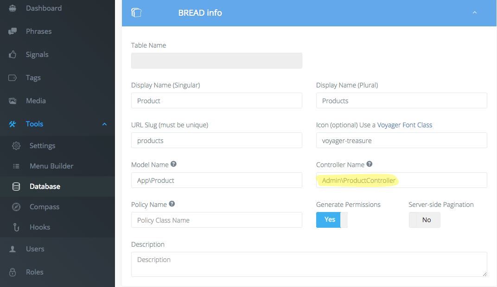

# voyager-translatable-formfield
Add a Voyager FormField type of 'translatable' that utilizes translatable data on a Model that uses dimsav/laravel-translatable

## Installation

1. Clone repository to `your_project/packages/mattrabe/voyager-translatable-formfield/`
1. Add Service Provider to config.app

```
        Mattrabe\VoyagerTranslatableFormField\VoyagerTranslatableFormFieldServiceProvider::class,
```


## Usage

1. Create a new admin controller (e.g. app/Http/Controllers/Admin/ProductController.php) which extends VoyagerBreadController
1. Set Voyager BREAD to use your new Controller. Voyager -> Tools -> Database -> Edit BREAD (Add BREAD if you have not already) -> Set Controller Name to the name of your controller ('App\Http\' is automatically prefixed) 
1. Use `$dataType->editRows->add()` and `createTranslatableDataRow()` to add translatable data rows to the interface

```
<?php

namespace App\Http\Controllers\Admin;

class ProductController extends \TCG\Voyager\Http\Controllers\VoyagerBreadController
{
    public function edit(Request $request, $id)
    {

        ...

        $dataType = Voyager::model('DataType')->where('slug', '=', $slug)->first();

        // Add translatable row
        $dataType->editRows->add(\Mattrabe\VoyagerTranslatableFormField\VoyagerTranslatableFormField::createTranslatableDataRow([
            'model_data_type' => 'products',
            'field' => 'description',
            'type' => 'text_area',
            'table_name' => 'product_translations',             // optional
            'display_name' => 'Translations of Description',    // optional
        ]));

        ...

    }

}
```

1. Edit your read view for the model - add clause for 'translatable' field type into `@if($row->type == ...)` block. Example:

```
    @elseif($row->type == 'translatable')
        @foreach ($dataTypeContent->getTranslations($row->field_name) as $k=>$v)
            <p>{{ $k }}: {{ $v }}</p>
        @endforeach
```


## Modifying views

1. `php artisan vendor publish` to publish views to resources/views/voyager-translatable-formfield/
1. Modify to your liking

